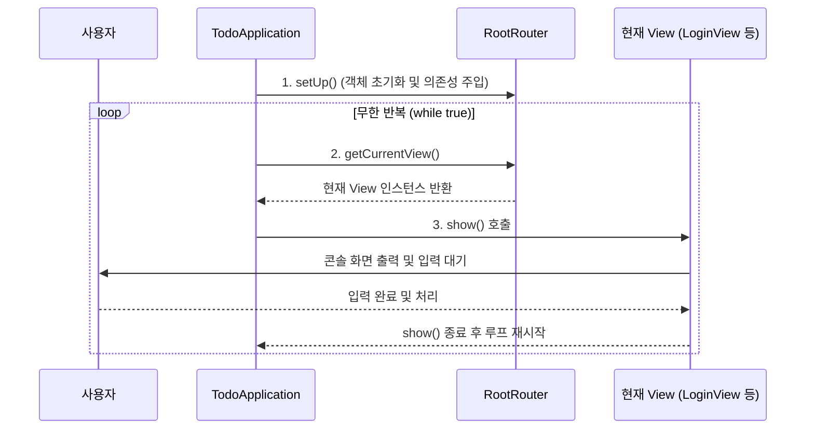

# 📄 [클래스 01] TodoApplication.java

- **소속 패키지**: `com.korai.ch10.TODO`
- **파일 위치**: [`TodoApplication.java`](file:///Users/kangminjae/Documents/gov/java/study/src/main/java/com/korai/ch10/TODO/TodoApplication.java)
- **주요 역할**: 프로그램의 시작점(Entry Point) 및 화면 무한 반복 실행 루프(Event Loop) 담당

---

## 1. 왜 이 클래스를 만들었는가? (설계 배경)

Java 프로그램은 반드시 `main()` 메서드에서 시작됩니다.  
하지만 콘솔 애플리케이션은 한 번 실행되고 바로 종료되면 안 되고, 사용자가 작업을 계속 진행할 수 있도록 **화면을 지속적으로 유지하고 입력을 기다리는 구조**가 필요합니다.

`TodoApplication`은:
1. 애플리케이션 시작 시 필요한 모든 부품(객체)들을 준비(`RootRouter.setUp()`)시키고,
2. 무한 루프(`while (true)`)를 돌며 현재 보여주어야 할 화면(`RootRouter.getCurrentView()`)을 화면에 표시(`show()`)하는 **단순하면서도 강력한 오케스트레이터(지휘자)** 역할을 합니다.

---

## 2. 코드 전체 보기 (상세 주석 포함)

```java
package com.korai.ch10.TODO;

// [작성 이유]: 다른 패키지에 분리된 Router를 가져와서 사용하기 위해 import 합니다.
import com.korai.ch10.TODO.router.RootRouter;

public class TodoApplication {

    public static void main(String[] args) {
        /*
         * [작성 이유: RootRouter.setUp()]
         * 프로그램이 본격적으로 실행되기 전에, 필요한 모든 저장소(Repository),
         * 비즈니스 서비스(Service), 화면(View) 객체들을 생성하고 서로 연결(의존성 주입)합니다.
         * 이 한 줄을 통해 프로그램의 초기 설정(부트스트랩)이 완료됩니다.
         */
        RootRouter.setUp();

        /*
         * [작성 이유: while (true)]
         * 콘솔 프로그램은 1회성 실행 후 바로 종료되면 안 됩니다.
         * 사용자가 종료(Q/q)하거나 프로그램을 끌 때까지 화면을 계속 갱신하며 보여주어야 하므로
         * 이벤트 루프(Event Loop) 형태로 무한 반복을 돕니다.
         */
        while (true) {
            /*
             * [작성 이유: RootRouter.getCurrentView().show()]
             * 1. RootRouter.getCurrentView() : 현재 보여주어야 하는 화면(View 인터페이스 구현체)을 가져옵니다.
             * 2. .show() : 다형성(Polymorphism) 덕분에 그 화면이 로그인 화면이든, 목록 화면이든
             *    구체적인 클래스 타입에 상관없이 통일된 show() 메서드를 호출할 수 있습니다.
             * 3. 사용자가 어떤 작업을 하든, 현재 화면의 show()가 끝나면 다음 루프에서 변경된 화면을 보여줍니다.
             */
            RootRouter.getCurrentView().show();
        }
    }
}
```

---

## 3. 핵심 코드 심층 해설 (왜 이렇게 작성했는가?)

### Q1. `main` 메서드 안에 복잡한 화면 출력이나 로그인 코드를 직접 넣지 않은 이유는 무엇인가요?
- **단일 책임 원칙 (SRP, Single Responsibility Principle)** 때문입니다.
- `main` 메서드가 직접 사용자의 입력을 받고 화면을 그리기 시작하면 코드가 수백 줄로 비대해지고 수정이 어려워집니다.
- 따라서 `main` 메서드는 **"초기 설정 준비"**와 **"화면 띄우기 반복"**이라는 가장 높은 수준의 실행 흐름만 관리하고, 실제 화면 로직은 `View`와 `Router`에게 위임했습니다.

### Q2. `while (true)`가 돌면 컴퓨터가 멈추거나 과부하가 걸리지 않나요?
- `show()` 메서드 내부에서 `Scanner.nextLine()`을 호출하기 때문에, 사용자가 콘솔에 글자를 입력하고 엔터를 누를 때까지 프로그램 실행이 일시 정지(Blocking I/O 대기) 상태가 됩니다.
- 따라서 CPU를 100% 소모하지 않고 사용자의 입력을 안전하게 기다립니다.

---

## 4. 실행 흐름 다이어그램


