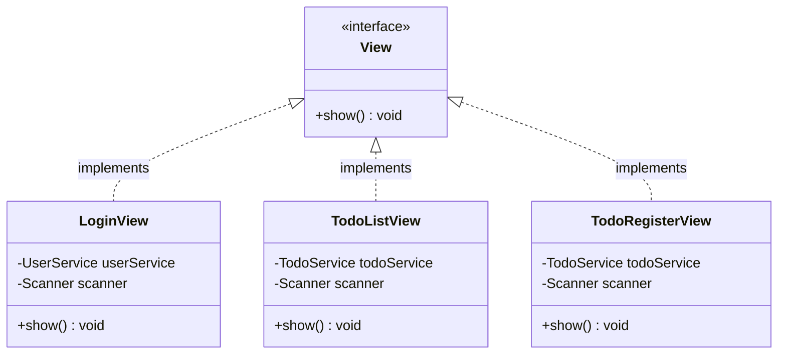

# 📄 [클래스 02] View.java (인터페이스)

- **소속 패키지**: `com.korai.ch10.TODO.view`
- **파일 위치**: [`View.java`](file:///Users/kangminjae/Documents/gov/java/study/src/main/java/com/korai/ch10/TODO/view/View.java)
- **주요 역할**: 모든 화면(View) 클래스들이 반드시 따라야 할 표준 규격(인터페이스) 정의

---

## 1. 왜 이 인터페이스를 만들었는가? (설계 배경)

애플리케이션에는 로그인 화면(`LoginView`), 목록 화면(`TodoListView`), 등록 화면(`TodoRegisterView`) 등 여러 종류의 화면이 존재합니다.

만약 이 공통 인터페이스가 없다면:
- `TodoApplication`이나 `RootRouter`는 현재 화면이 로그인인지 목록인지 일일이 `instanceof`나 `if-else`문으로 검사해서 각각 다른 메서드를 호출해야 합니다.
- 화면이 추가될 때마다 메인 로직의 코드를 뜯어고쳐야 하는 비효율이 발생합니다.

따라서 모든 화면 클래스가 **"화면을 보여주고 입력을 처리하는 동작은 반드시 `show()`라는 이름으로 구현한다"**는 공통 약속(Contract)을 만들기 위해 `View` 인터페이스를 정의했습니다.

---

## 2. 코드 전체 보기 (상세 주석 포함)

```java
package com.korai.ch10.TODO.view;

/*
 * [작성 이유: interface View]
 * 객체지향 5대 원칙 중 OCP(개방-폐쇄 원칙)와 DIP(의존 역전 원칙)를 달성하기 위한 인터페이스입니다.
 * 구체적인 화면 구현체(LoginView, TodoListView 등)에 직접 의존하지 않고,
 * 이 View 인터페이스 규격에 의존하게 함으로써 새로운 화면이 추가되어도 기존 시스템이 깨지지 않습니다.
 */
public interface View {

    /*
     * [작성 이유: public void show()]
     * - 화면을 콘솔에 출력하고, 사용자의 입력을 받아 다음 상태로 전환하는
     *   화면의 핵심 생명주기(Lifecycle) 메서드입니다.
     * - 반환 타입이 void인 이유는 화면이 자신의 역할을 다하고 나면
     *   라우터를 통해 다음 화면으로 전환하는 책임을 직접 수행하기 때문입니다.
     */
    public void show();

}
```

---

## 3. 핵심 설계 포인트 (다형성의 위력)

### 🌟 다형성 (Polymorphism) 적용 효과
`RootRouter`의 화면 저장소는 다음과 같이 `Map<String, View>` 형태로 관리됩니다:

```java
Map<String, View> viewMap = Map.of(
    "login", loginView,             // LoginView는 View의 자식
    "todo-list", todoListView,       // TodoListView는 View의 자식
    "todo-register", todoRegisterView // TodoRegisterView는 View의 자식
);
```

그리고 메인 루프에서는 화면의 진짜 타입을 몰라도 단 한 줄로 실행할 수 있습니다:
```java
RootRouter.getCurrentView().show();
```
- 만약 나중에 `TodoDeleteView`(삭제 화면)나 `UserRegisterView`(회원가입 화면)를 추가하더라도, `View` 인터페이스만 `implements`하면 메인 실행 코드(`TodoApplication`)는 단 한 글자도 수정할 필요가 없습니다.

---

## 4. 클래스 상속 및 구현 구조


