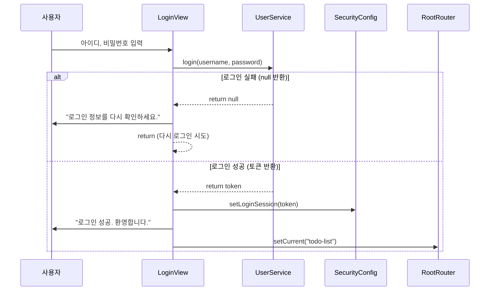

# 📄 [클래스 03] LoginView.java

- **소속 패키지**: `com.korai.ch10.TODO.view`
- **파일 위치**: [`LoginView.java`](file:///Users/kangminjae/Documents/gov/java/study/src/main/java/com/korai/ch10/TODO/view/LoginView.java)
- **주요 역할**: 로그인 화면 출력, 사용자 입력(아이디/비밀번호) 수신, 인증 요청 및 세션 등록

---

## 1. 왜 이 클래스를 만들었는가? (설계 배경)

사용자가 TODO 애플리케이션을 처음 실행했을 때 가장 먼저 마주하는 화면입니다.  
사용자로부터 아이디(`username`)와 비밀번호(`password`)를 안전하게 입력받고, 비즈니스 로직을 처리하는 `UserService`에게 인증을 요청한 뒤 결과에 따라 적절한 다음 행동(실패 메시지 안내 또는 메인 목록 화면 전환)을 결정하는 책임을 갖습니다.

---

## 2. 코드 전체 보기 (상세 주석 포함)

```java
package com.korai.ch10.TODO.view;

// [작성 이유]: 인증 성공 후 발급된 세션 토큰을 전역 세션 저장소에 보관하기 위해 import
import com.korai.ch10.TODO.config.SecurityConfig;
// [작성 이유]: 로그인 성공 후 할 일 목록 화면("todo-list")으로 페이지를 넘기기 위해 import
import com.korai.ch10.TODO.router.RootRouter;
// [작성 이유]: 실제 아이디/비밀번호 검증 비즈니스 로직을 위임하기 위해 import
import com.korai.ch10.TODO.service.UserService;

import java.util.Scanner;

public class LoginView implements View {

    // [작성 이유]: 사용자 인증 비즈니스 로직을 호출하기 위한 서비스 객체 참조 변수
    private UserService userService;
    // [작성 이유]: 콘솔로부터 키보드 입력을 받기 위한 Scanner 객체 참조 변수
    private Scanner scanner;

    /*
     * [작성 이유: 생성자 의존성 주입 (Dependency Injection)]
     * LoginView 내부에서 'new UserService()'로 객체를 직접 생성하지 않고,
     * 외부(RootRouter)에서 생성된 UserService 객체를 매개변수로 주입받습니다.
     * -> 이유: 객체 간 결합도를 낮추고, 추후 Mock 객체 등을 통한 단위 테스트가 수월해집니다.
     * 또한 뷰가 생성될 때 Scanner도 1회만 초기화하여 메모리 낭비를 줄입니다.
     */
    public LoginView(UserService userService) {
        this.userService = userService;
        this.scanner = new Scanner(System.in);
    }

    @Override
    public void show() {
        String username;
        String password;

        // [작성 이유]: 콘솔 화면에 로그인 양식을 직관적으로 출력
        System.out.println("[ TODO LIST 로그인 ]");
        System.out.print("username :  ");
        username = scanner.nextLine(); // 사용자 아이디 입력 대기
        System.out.print("password : ");
        password = scanner.nextLine(); // 사용자 비밀번호 입력 대기

        /*
         * [작성 이유: userService.login(username, password)]
         * 화면(View)은 오직 '입력과 출력'만 담당해야 합니다.
         * "비밀번호가 맞는지, 회원이 존재하는지"를 판단하는 것은 비즈니스 로직이므로
         * UserService에 위임하고, 그 결과로 생성된 토큰(또는 null)만 돌려받습니다.
         */
        String token = userService.login(username, password);

        /*
         * [작성 이유: Early Return 패턴 (조기 종료)]
         * 로그인이 실패한 경우(token == null), 아래의 성공 로직을 건너뛰고
         * 즉시 함수를 빠져나갑니다.
         * if-else 중첩을 피하여 코드의 가독성을 극대화하는 기법입니다.
         */
        if (token == null) {
            System.out.println("로그인 정보를 다시 확인하세요.");
            System.out.println("엔터를 눌러 다시 입력하세요.");
            scanner.nextLine(); // 사용자가 에러 메시지를 충분히 읽고 엔터를 칠 때까지 잠시 대기
            return; // void 함수이므로 return으로 현재 화면 실행을 끝내고 메인 루프로 돌아감
        }

        /*
         * [작성 이유: SecurityConfig.setLoginSession(token)]
         * 로그인에 성공했으므로 발급받은 토큰을 전역 세션에 보관합니다.
         * 이후 TodoService 등 다른 기능에서 "누가 로그인했는지" 확인할 때 사용됩니다.
         */
        SecurityConfig.setLoginSession(token);

        // [작성 이유: String.format으로 환영 메시지 동적 포맷팅]
        System.out.println(String.format("로그인 성공. %s님 환영합니다.", username));

        /*
         * [작성 이유: RootRouter.setCurrent("todo-list")]
         * 로그인이 끝났으므로 다음 루프에서 보여줄 화면을 할 일 목록("todo-list")으로 변경합니다.
         */
        RootRouter.setCurrent("todo-list");
    }
}
```

---

## 3. 핵심 코드 심층 해설 (왜 이렇게 작성했는가?)

### Q1. `scanner.nextLine()`을 실패 메시지 뒤에 한 번 더 호출한 이유는 무엇인가요?
- 콘솔 프로그램 특성상 `show()`가 끝나면 메인 루프에 의해 곧바로 화면이 지워지거나 다시 로그인 창이 뜹니다.
- 만약 대기 코드 없이 바로 끝나버리면 사용자가 "로그인 정보를 다시 확인하세요"라는 에러 메시지를 읽지도 못한 채 화면이 지나가 버립니다.
- 따라서 `scanner.nextLine()`으로 사용자가 엔터를 누를 때까지 멈추어 두어 UX(사용자 경험)를 배려한 것입니다.

### Q2. 왜 `return;`으로 조기 종료(Early Return)를 했나요?
- `if (token != null) { ... } else { ... }` 형태로 작성할 수도 있지만, 코드가 길어지면 들여쓰기가 깊어져 가독성이 떨어집니다.
- 예외 상황(실패)을 먼저 걸러내고 조기 리턴함으로써 성공 흐름의 코드를 평평(Flat)하고 읽기 쉽게 유지할 수 있습니다.

---

## 4. 로그인 처리 시퀀스


