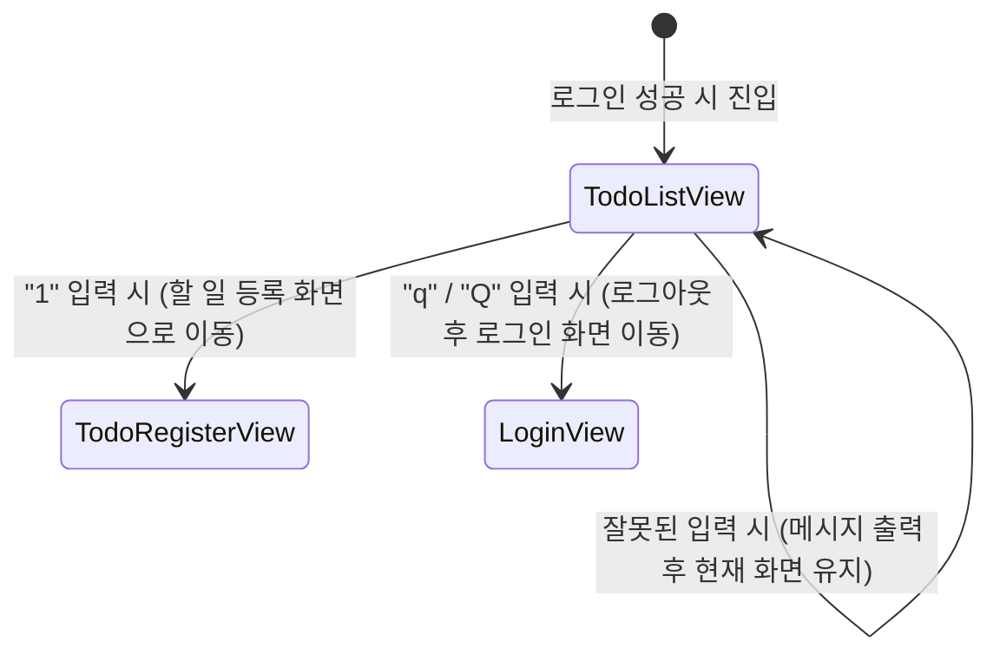

# 📄 [클래스 04] TodoListView.java

- **소속 패키지**: `com.korai.ch10.TODO.view`
- **파일 위치**: [`TodoListView.java`](file:///Users/kangminjae/Documents/gov/java/study/src/main/java/com/korai/ch10/TODO/view/TodoListView.java)
- **주요 역할**: 등록된 할 일 목록을 화면에 출력하고, 다음 작업(등록/완료/로그아웃) 메뉴를 제공

---

## 1. 왜 이 클래스를 만들었는가? (설계 배경)

사용자가 로그인에 성공했을 때 보게 되는 **메인 대시보드 화면**입니다.  
현재 저장된 할 일들을 한눈에 보여주고, 사용자가 할 일을 새로 등록하거나 다른 작업을 선택할 수 있도록 분기 처리를 제공하는 핵심 View입니다.

---

## 2. 코드 전체 보기 (상세 주석 포함)

```java
package com.korai.ch10.TODO.view;

// [작성 이유]: 목록에서 할 일 엔티티 객체를 꺼내어 다루기 위해 import
import com.korai.ch10.TODO.entity.Todo;
// [작성 이유]: 메뉴 선택에 따라 화면 전환(todo-register, login)을 요청하기 위해 import
import com.korai.ch10.TODO.router.RootRouter;
// [작성 이유]: 할 일 목록 데이터를 조회하기 위해 import
import com.korai.ch10.TODO.service.TodoService;

import java.util.Scanner;

public class TodoListView implements View {

    private Scanner scanner;
    private TodoService todoService;

    /*
     * [작성 이유: 생성자 의존성 주입]
     * 외부에서 TodoService를 주입받아 할 일 목록 데이터를 안전하게 조회할 수 있도록 연결합니다.
     */
    public TodoListView(TodoService todoService) {
        this.scanner = new Scanner(System.in);
        this.todoService = todoService;
    }

    /*
     * [작성 이유: show()의 책임 분할]
     * show() 메서드 하나에 모든 코드를 때려 넣지 않고,
     * 1) 목록을 출력하는 부분 (printTodoList)
     * 2) 메뉴를 출력하고 선택을 받는 부분 (showSelectList)
     * 두 개의 private 헬퍼 메서드로 역할을 명확히 쪼개어 가독성과 유지보수성을 높였습니다.
     */
    @Override
    public void show() {
        System.out.println("[ TODO LIST 목록 ]");
        printTodoList();
        showSelectList();
    }

    /*
     * [작성 이유: private void printTodoList()]
     * 저장된 모든 할 일을 순회하며 콘솔에 출력하는 전담 메서드입니다.
     */
    private void printTodoList() {
        /*
         * [작성 이유: 리스트 크기 0 체크]
         * 아직 등록된 할 일이 없을 때 빈 화면만 덜렁 나오면 사용자가 당황할 수 있으므로,
         * "등록된 할 일이 없습니다."라는 친절한 안내 문구를 띄우고 종료합니다.
         */
        if (todoService.getTodoList().size() == 0) {
            System.out.println("등록된 할 일이 없습니다.");
            return;
        }

        /*
         * [작성 이유: 향상된 for문(for-each)]
         * 리스트 내의 모든 Todo 객체를 순회합니다.
         * System.out.println(todo)를 호출하면 Todo 클래스의 Lombok @Data가
         * 만들어준 toString() 메서드가 자동으로 호출되어 내용이 예쁘게 출력됩니다.
         * (추후 개선점: 현재 로그인한 사용자의 할 일만 볼 수 있도록 필터링 기능 확장 가능)
         */
        for (Todo todo : todoService.getTodoList()) {
            System.out.println(todo);
        }
    }

    /*
     * [작성 이유: private void showSelectList()]
     * 사용자가 다음으로 취할 수 있는 액션 목록을 보여주고 콘솔 입력을 처리합니다.
     */
    private void showSelectList() {
        String cmd;

        System.out.println("1. 할 일 등록");
        System.out.println("2. 완료상태 수정");
        System.out.println("Q : 로그아웃하기");
        System.out.print(">>> ");
        cmd = scanner.nextLine(); // 사용자 명령어 입력 대기

        /*
         * [작성 이유: "1".equals(cmd) 형태의 리터럴 비교]
         * cmd.equals("1")로 작성할 경우, 만약 cmd가 null이면 NullPointerException이 발생합니다.
         * 하지만 "1".equals(cmd)처럼 문자열 리터럴을 앞에 두면 cmd가 null이어도
         * 에러가 나지 않고 안전하게 false를 반환합니다. (Null-safe 코딩 관례)
         */
        if ("1".equals(cmd)) {
            // [작성 이유]: 할 일 등록 화면으로 전환
            RootRouter.setCurrent("todo-register");
        } else if ("q".equalsIgnoreCase(cmd)) { // 'q' 또는 'Q' 입력 시
            // [작성 이유]: 로그아웃하여 다시 첫 로그인 화면으로 전환
            RootRouter.setCurrent("login");
        } else {
            // [작성 이유]: 잘못된 번호를 입력했을 때 재입력 안내
            System.out.println("다시입력하세요");
        }
    }
}
```

---

## 3. 핵심 코드 심층 해설 (왜 이렇게 작성했는가?)

### Q1. 왜 `show()` 안에서 직접 코딩하지 않고 `printTodoList()`와 `showSelectList()`로 분리했나요?
- **메서드 추출 리팩토링 (Extract Method)** 기법입니다.
- 화면은 크게 '데이터를 보여주는 영역'과 '사용자의 상호작용(선택)을 받는 영역'으로 구분됩니다. 이렇게 분리해 두면 목록 출력 양식을 바꿀 때는 `printTodoList()`만 고치고, 메뉴를 추가할 때는 `showSelectList()`만 고치면 되므로 코드 영향 범위가 좁아집니다.

### Q2. `"1".equals(cmd)` vs `cmd.equals("1")`의 차이는?
- 실무 자바 코딩 표준에서 매우 중요한 부분입니다.
- 변수가 null일 가능성이 조금이라도 있는 경우, 상수 문자열을 기준(`"1".equals(...)`)으로 비교하면 **절대 `NullPointerException(NPE)`이 발생하지 않습니다.**

---

## 4. 화면 제어 및 상태 전이도


