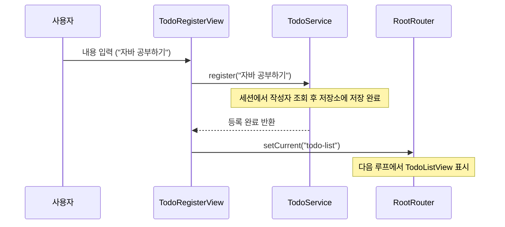

# 📄 [클래스 05] TodoRegisterView.java

- **소속 패키지**: `com.korai.ch10.TODO.view`
- **파일 위치**: [`TodoRegisterView.java`](file:///Users/kangminjae/Documents/gov/java/study/src/main/java/com/korai/ch10/TODO/view/TodoRegisterView.java)
- **주요 역할**: 새로운 할 일 내용(Content)을 입력받아 비즈니스 서비스에 등록을 요청하는 화면

---

## 1. 왜 이 클래스를 만들었는가? (설계 배경)

사용자가 할 일 목록 화면에서 `1. 할 일 등록` 메뉴를 선택했을 때 전환되는 입력 화면입니다.  
사용자로부터 할 일의 구체적인 내용 문자열을 입력받아 `TodoService`에 전달하고, 등록이 끝나면 사용자가 방금 등록한 항목을 즉시 확인할 수 있도록 다시 목록 화면(`todo-list`)으로 전환해 주는 단순 명료한 책임을 담당합니다.

---

## 2. 코드 전체 보기 (상세 주석 포함)

```java
package com.korai.ch10.TODO.view;

// [작성 이유]: 등록이 끝나면 목록 화면("todo-list")으로 복귀시키기 위해 import
import com.korai.ch10.TODO.router.RootRouter;
// [작성 이유]: 실제 할 일 저장 및 유저 매핑 비즈니스 로직을 수행하는 서비스 객체를 사용하기 위해 import
import com.korai.ch10.TODO.service.TodoService;

import java.util.Scanner;

public class TodoRegisterView implements View {

    // [작성 이유]: 불변성(Immutability) 보장을 위해 final로 선언한 TodoService 참조 변수
    private final TodoService todoService;
    // [작성 이유]: 키보드 입력을 처리하기 위한 Scanner 객체
    private Scanner scanner;

    /*
     * [작성 이유: 생성자 의존성 주입 (DI)]
     * 필요한 TodoService를 외부에서 주입받아 저장합니다.
     * final 필드이므로 생성자 시점에 반드시 초기화되어 null 상태를 방지합니다.
     */
    public TodoRegisterView(TodoService todoService) {
        this.todoService = todoService;
        this.scanner = new Scanner(System.in);
    }

    @Override
    public void show() {
        String content;

        // [작성 이유]: 사용자에게 친절한 입력 폼 UI 제공
        System.out.println("[ 할 일 등록하기 ]");
        System.out.print("내용 : ");

        /*
         * [작성 이유: scanner.nextLine()]
         * 사용자가 스페이스(공백)를 포함한 문장 전체(예: "자바 10장 복습하기")를
         * 입력할 수 있도록 next() 대신 nextLine()을 사용합니다.
         */
        content = scanner.nextLine();

        /*
         * [작성 이유: todoService.register(content)]
         * 화면(View)은 사용자가 "어떤 텍스트를 적었는가"만 알고 넘겨주면 됩니다.
         * "현재 로그인한 사람이 누구인가?", "새 Todo의 번호(ID)는 몇 번인가?" 같은
         * 복잡한 저장 규칙은 모조리 TodoService 내부에서 처리하도록 캡슐화(Encapsulation)했습니다.
         */
        todoService.register(content);

        /*
         * [작성 이유: RootRouter.setCurrent("todo-list")]
         * 할 일 등록이 성공적으로 완료되었으므로, 사용자가 방금 쓴 글을 확인할 수 있도록
         * 목록 화면으로 즉시 상태를 전환합니다.
         */
        RootRouter.setCurrent("todo-list");
    }
}
```

---

## 3. 핵심 코드 심층 해설 (왜 이렇게 작성했는가?)

### Q1. 왜 `TodoRegisterView`는 `User` 정보를 전혀 모르고 오직 `content`만 넘기나요?
- **화면 계층의 캡슐화 및 책임 분리**를 위해서입니다.
- 화면이 현재 로그인된 유저 세션 토큰을 직접 꺼내고, 파싱하고, 유저 객체를 조회하기 시작하면 화면 코드가 서비스 코드처럼 복잡해집니다.
- 화면은 오직 UI에서 입력받은 `content`만 넘기고, 세션에서 사용자를 식별하여 저장하는 일은 `TodoService`가 전담하는 것이 올바른 역할 분담입니다.

### Q2. 등록 후 화면 전환을 왜 `"todo-list"`로 하나요?
- 사용자가 글이나 할 일을 등록하고 나면 가장 자연스러운 다음 흐름은 **"내가 쓴 글이 잘 등록되었는지 확인하는 것"**입니다.
- 따라서 사용자가 번거롭게 메뉴를 다시 누를 필요 없이 즉시 목록 화면으로 이동시켜 만족스러운 UX를 제공합니다.

---

## 4. 할 일 등록 협력 흐름도


