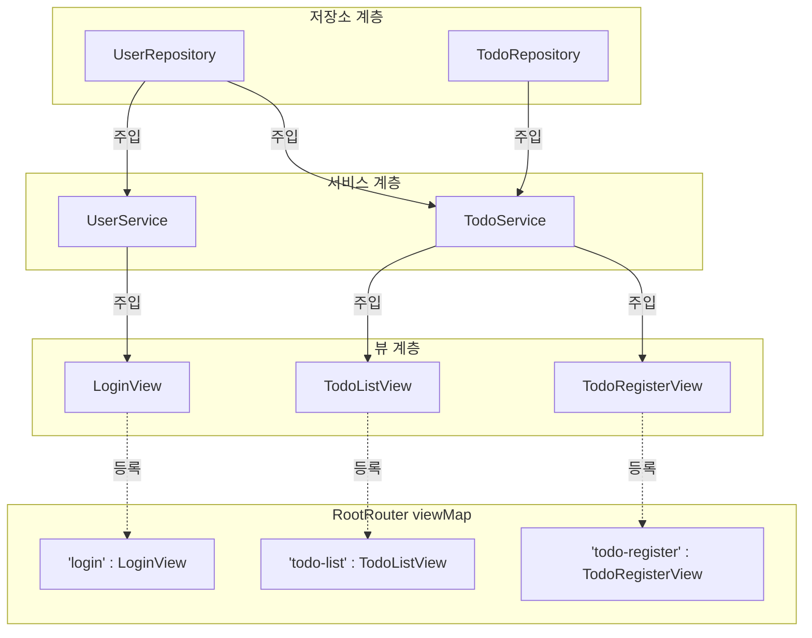

# 📄 [클래스 06] RootRouter.java

- **소속 패키지**: `com.korai.ch10.TODO.router`
- **파일 위치**: [`RootRouter.java`](file:///Users/kangminjae/Documents/gov/java/study/src/main/java/com/korai/ch10/TODO/router/RootRouter.java)
- **주요 역할**: 화면 간 전환(Routing) 총괄 관리 및 애플리케이션 전체 객체의 조립소(IoC 컨테이너 / DI 조립기)

---

## 1. 왜 이 클래스를 만들었는가? (설계 배경)

여러 화면이 존재하는 애플리케이션에서:
1. 각 화면들이 자기 마음대로 다른 화면을 `new LoginView()` 처럼 새로 만들면 메모리가 낭비되고 객체 간의 관계가 거미줄처럼 엉켜버립니다 (스파게티 코드).
2. 또한 "현재 무슨 화면을 보여주어야 하는가?"를 전역적으로 조율해 주는 교통정리 경찰관이 필요합니다.

`RootRouter`는 **단 한 곳에서 모든 객체(Repository, Service, View)를 순서에 맞게 생성하여 연결(조립)**해 두고, 문자열 경로 키(`"login"`, `"todo-list"`, `"todo-register"`)를 통해 현재 화면을 전환하고 꺼내 쓸 수 있도록 돕는 핵심 인프라 클래스입니다.

---

## 2. 코드 전체 보기 (상세 주석 포함)

```java
package com.korai.ch10.TODO.router;

// [작성 이유]: 조립에 필요한 하위 Repository, Service, View 클래스들을 import
import com.korai.ch10.TODO.repository.TodoRepository;
import com.korai.ch10.TODO.repository.UserRepository;
import com.korai.ch10.TODO.service.TodoService;
import com.korai.ch10.TODO.service.UserService;
import com.korai.ch10.TODO.view.LoginView;
import com.korai.ch10.TODO.view.TodoListView;
import com.korai.ch10.TODO.view.TodoRegisterView;
import com.korai.ch10.TODO.view.View;

import java.util.Map;

public class RootRouter {

    /*
     * [작성 이유: private static String current = "login"]
     * 현재 활성화된 화면의 경로(Path) 이름을 저장합니다.
     * 프로그램이 처음 시작될 때는 무조건 로그인 화면부터 보여야 하므로 기본값을 "login"으로 초기화합니다.
     */
    private static String current = "login";

    /*
     * [작성 이유: private static Map<String, View> viewMap]
     * 화면 이름("login", "todo-list" 등)과 실제 화면 인스턴스(View 객체)를
     * 1:1로 매핑하여 보관하는 일종의 '라우팅 테이블(Routing Table)'입니다.
     * Map의 Key로 검색하면 O(1)의 빠른 속도로 화면을 꺼내올 수 있습니다.
     */
    private static Map<String, View> viewMap;

    /*
     * [작성 이유: public static void setUp()]
     * 스프링(Spring) 프레임워크의 ApplicationContext나 IoC 컨테이너처럼
     * 애플리케이션 기동 시 단 한 번 실행되어 모든 의존성을 조립하는 메서드입니다.
     */
    public static void setUp() {
        /*
         * [객체 조립 순서의 원칙]: 하위 레이어(Repository)부터 먼저 만들고 -> 상위 레이어에 주입한다!
         */

        // 1. 유저 관련 객체 조립: Repository 생성 -> Service에 주입 -> View에 주입
        UserRepository userRepository = new UserRepository();
        UserService userService = new UserService(userRepository);
        LoginView loginView = new LoginView(userService);

        // 2. 할 일 관련 객체 조립:
        // TodoService는 할 일을 저장할 TodoRepository뿐만 아니라
        // 작성자를 찾기 위해 UserRepository도 필요하므로 2개의 리포지토리를 모두 주입합니다.
        TodoRepository todoRepository = new TodoRepository();
        TodoService todoService = new TodoService(todoRepository, userRepository);
        TodoListView todoListView = new TodoListView(todoService);

        // 3. 등록 뷰 조립: TodoService를 주입받음
        TodoRegisterView todoRegisterView = new TodoRegisterView(todoService);

        /*
         * [작성 이유: Map.of(...) 불변 맵 생성]
         * Java 9에서 도입된 Map.of()는 키-값 쌍을 간결하게 불변(Immutable) Map으로 만들어 줍니다.
         * 실행 중에 라우팅 테이블이 실수로 변경되거나 추가/삭제되는 것을 방지합니다.
         */
        viewMap = Map.of(
                "login", loginView,
                "todo-list", todoListView,
                "todo-register", todoRegisterView
        );
    }

    // [작성 이유]: 현재 설정된 화면 경로 이름을 조회
    public static String getCurrent() {
        return current;
    }

    /*
     * [작성 이유: public static View getCurrentView()]
     * TodoApplication의 메인 루프에서 호출하며, 현재 current 경로에 해당하는
     * View 구현체 객체를 다형적(View 인터페이스)으로 꺼내어 반환합니다.
     */
    public static View getCurrentView() {
        return viewMap.get(current);
    }

    /*
     * [작성 이유: public static void setCurrent(String path)]
     * 각 View에서 화면 이동을 원할 때(예: 로그인 성공 후 todo-list 이동)
     * 이 메서드를 호출하여 다음 표시할 화면 경로를 변경합니다.
     */
    public static void setCurrent(String path) {
        current = path;
    }
}
```

---

## 3. 핵심 코드 심층 해설 (왜 이렇게 작성했는가?)

### Q1. 왜 `setUp()`에서 하위 계층부터 생성하나요?
- 생성자 주입의 기본 규칙입니다.
- `LoginView`를 만들려면 `UserService`가 먼저 존재해야 하고, `UserService`를 만들려면 `UserRepository`가 먼저 존재해야 합니다.
- 따라서 가장 독립적인 `Repository` $\rightarrow$ 비즈니스 로직의 `Service` $\rightarrow$ 화면 표현의 `View` 순서로 조립해야 합니다.

### Q2. 왜 메서드와 필드들이 모두 `static`인가요?
- 애플리케이션 전체에서 화면 상태(`current`)와 화면 목록(`viewMap`)은 오직 하나만 존재해야 하는 **전역 싱글톤(Global Singleton) 자원**이기 때문입니다.
- 어디서든 `RootRouter.setCurrent("todo-list")` 처럼 인스턴스 생성 없이 편리하게 화면 전환을 명령할 수 있습니다.

---

## 4. 객체 조립(DI) 및 매핑 구조도


