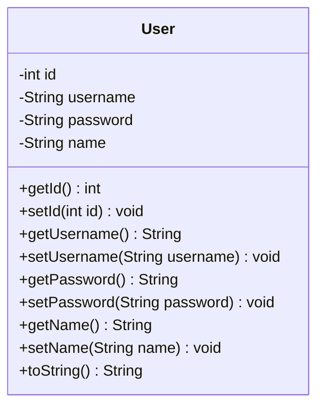

# 📄 [클래스 08] User.java (엔티티)

- **소속 패키지**: `com.korai.ch10.TODO.entity`
- **파일 위치**: [`User.java`](file:///Users/kangminjae/Documents/gov/java/study/src/main/java/com/korai/ch10/TODO/entity/User.java)
- **주요 역할**: 시스템의 사용자(회원) 정보를 표현하는 도메인 데이터 모델(Entity)

---

## 1. 왜 이 클래스를 만들었는가? (설계 배경)

소프트웨어에서 사용자의 정보를 다룰 때 `String username`, `String password`, `String name` 등의 변수를 낱개로 따로 들고 다니면 코드가 매우 지저분해지고 실수하기 쉽습니다.  
관련된 사용자 정보들을 하나의 의미 있는 객체(묶음)로 다루기 위해 정의한 클래스가 바로 `User` 엔티티입니다.

---

## 2. 코드 전체 보기 (상세 주석 포함)

```java
package com.korai.ch10.TODO.entity;

// [작성 이유]: 모든 필드를 매개변수로 받는 생성자를 자동 생성하기 위해 Lombok import
import lombok.AllArgsConstructor;
// [작성 이유]: Getter, Setter, toString, equals, hashCode를 자동 생성하기 위해 Lombok import
import lombok.Data;

/*
 * [작성 이유: @Data 어노테이션]
 * Lombok 라이브러리가 제공하는 가장 강력한 편의 어노테이션입니다.
 * - 모든 필드의 Getter와 Setter 자동 생성
 * - 객체 내용을 문자열로 보여주는 toString() 자동 생성
 * - 객체의 동등성 비교를 위한 equals() 및 hashCode() 자동 생성
 * -> 수십 줄의 반복적인 보일러플레이트 코드를 제거하여 코드가 매우 깔끔해집니다.
 */
@Data
/*
 * [작성 이유: @AllArgsConstructor 어노테이션]
 * 모든 필드(id, username, password, name)를 인자로 받아 초기화하는 생성자를 만듭니다.
 * new User(1, "test1", "1234", "강민재") 형태로 객체를 손쉽게 한 줄로 생성할 수 있습니다.
 */
@AllArgsConstructor
public class User {

    /*
     * [작성 이유: private int id]
     * 사용자의 고유 식별 번호(Primary Key, PK)입니다.
     * 동명이인이 있거나 아이디를 변경하더라도 변하지 않는 유일한 데이터베이스 ID 역할을 합니다.
     */
    private int id;

    /*
     * [작성 이유: private String username]
     * 로그인할 때 입력하는 사용자 계정 아이디입니다.
     */
    private String username;

    /*
     * [작성 이유: private String password]
     * 로그인 인증에 사용할 비밀번호입니다.
     */
    private String password;

    /*
     * [작성 이유: private String name]
     * 화면에 환영 문구를 띄우거나 프로필을 표시할 때 사용할 사용자의 실제 이름입니다.
     */
    private String name;

}
```

---

## 3. 핵심 코드 심층 해설 (왜 이렇게 작성했는가?)

### Q1. Lombok의 `@Data`와 `@AllArgsConstructor`를 쓴 이유는 무엇인가요?
- 순수 자바로 이 클래스를 작성하면 Getter 4개, Setter 4개, 모든 인자 생성자 1개, 기본 생성자 1개, `toString()` 1개 등으로 인해 코드가 60~70줄 이상으로 불어납니다.
- Lombok 어노테이션 2개만 선언하면 컴파일 시점에 바이트코드로 이 모든 메서드를 자동 생성해 주므로, 핵심 필드 정의에만 집중할 수 있어 코드의 가독성이 획기적으로 향상됩니다.

### Q2. 필드들의 접근 제어자가 왜 `private`인가요?
- **객체지향의 캡슐화(Encapsulation)** 원칙을 준수하기 위함입니다.
- 외부에서 `user.password = "123"` 처럼 필드에 직접 접근하여 오염시키는 것을 막고, `@Data`가 생성해 준 게터/세터 메서드를 통해 안전하게 접근하도록 유도합니다.

---

## 4. 클래스 다이어그램


