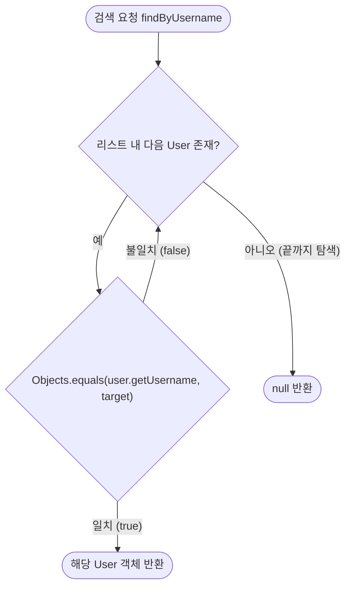

# 📄 [클래스 10] UserRepository.java

- **소속 패키지**: `com.korai.ch10.TODO.repository`
- **파일 위치**: [`UserRepository.java`](file:///Users/kangminjae/Documents/gov/java/study/src/main/java/com/korai/ch10/TODO/repository/UserRepository.java)
- **주요 역할**: 회원(User) 데이터의 저장 및 조회(DB 시뮬레이션)를 담당하는 저장소 계층

---

## 1. 왜 이 클래스를 만들었는가? (설계 배경)

실제 데이터베이스(MySQL, Oracle 등)를 연동하기 전 단계에서, 메모리 상에 회원 데이터를 보관하고 필요한 사용자를 검색할 수 있는 **데이터 접근 계층(Data Access Layer / Repository)**이 필요합니다.  
`UserRepository`는 비즈니스 로직(서비스)이 데이터가 어디에 어떻게 저장되어 있는지 신경 쓰지 않고 오직 "이 아이디로 유저 찾아줘", "이 번호로 유저 찾아줘"라고 요청할 수 있도록 저장소 역할을 추상화합니다.

---

## 2. 코드 전체 보기 (상세 주석 포함)

```java
package com.korai.ch10.TODO.repository;

// [작성 이유]: 조회 결과로 반환할 User 엔티티 클래스 import
import com.korai.ch10.TODO.entity.User;

import java.util.List;
// [작성 이유]: NullPointerException을 완벽하게 방지하는 안전한 비교를 위해 Objects 유틸리티 import
import java.util.Objects;

public class UserRepository {

    // [작성 이유]: 인메모리(RAM) 환경에서 회원 목록을 보관하는 리스트 변수
    private List<User> users;

    /*
     * [작성 이유: UserRepository 생성자]
     * 별도의 회원가입 화면이나 실제 DB 테이블이 없는 현재 환경에서,
     * 즉시 로그인 및 할 일 등록 테스트를 진행할 수 있도록 4명의 초기 더미(Mock) 데이터를 생성합니다.
     */
    public UserRepository() {
        User user1 = new User(1, "test1", "1q2w3e4r!", "강민재1");
        User user2 = new User(2, "test2", "1q2w3e4r!", "강민재2");
        User user3 = new User(3, "test3", "1q2w3e4r!", "강민재3");
        User user4 = new User(4, "test4", "1q2w3e4r!", "강민재4");

        /*
         * [작성 이유: List.of(...)]
         * Java 9+에서 제공하는 불변(Immutable) 리스트 생성 메서드입니다.
         * 시스템 초기 사용자 목록이 임의로 변조되지 않도록 안전하게 고정합니다.
         */
        users = List.of(user1, user2, user3, user4);
    }

    /*
     * [작성 이유: public User findByUsername(String username)]
     * 로그인 시 사용자가 입력한 username과 일치하는 회원을 검색합니다.
     */
    public User findByUsername(String username) {
        // [작성 이유]: 저장된 모든 사용자를 하나씩 순회하며 검사 (선형 탐색)
        for (User user : users) {
            /*
             * [작성 이유: Objects.equals(user.getUsername(), username)]
             * user.getUsername().equals(username) 대신 Objects.equals를 사용하는 이유:
             * 만약 user.getUsername()이 null인 경우 일반 .equals()는 NullPointerException이 터집니다.
             * Objects.equals는 내부적으로 null 체크를 해 주므로 어떤 상황에서도 안전합니다.
             */
            if (Objects.equals(user.getUsername(), username)) {
                return user; // 일치하는 사용자를 찾으면 즉시 반환
            }
        }
        // [작성 이유]: 리스트 전체를 다 뒤져도 일치하는 유저가 없으면 null 반환
        return null;
    }

    /*
     * [작성 이유: public User findById(int id)]
     * 로그인 세션 토큰에서 추출한 유저 번호(userId)로 원본 User 객체를 조회할 때 사용합니다.
     */
    public User findById(int id) {
        for (User user : users) {
            /*
             * [작성 이유: user.getId() == id]
             * id는 기본 자료형인 원시 타입 int이므로 '==' 연산자로 값 자체를 직접 비교합니다.
             */
            if (user.getId() == id) {
                return user; // 일치하는 id의 유저 반환
            }
        }
        return null; // 해당하는 id가 없으면 null 반환
    }
}
```

---

## 3. 핵심 코드 심층 해설 (왜 이렇게 작성했는가?)

### Q1. `user.getUsername().equals(...)` 대신 `Objects.equals(...)`를 쓴 이유는 무엇인가요?
- 실무 자바 개발에서 권장되는 **안전한 동등성 비교(Null-Safe Equals)** 기법입니다.
- `Objects.equals(a, b)`는 내부적으로 다음과 같이 구현되어 있습니다:
  ```java
  public static boolean equals(Object a, Object b) {
      return (a == b) || (a != null && a.equals(b));
  }
  ```
- 따라서 `a`나 `b` 중 어느 한쪽 또는 둘 다 `null`이더라도 예외(`NullPointerException`)를 발생시키지 않고 안전하게 `false` 또는 `true`를 반환합니다.

### Q2. 왜 유저를 찾는 메서드를 `findByUsername`과 `findById` 두 개나 만들었나요?
- **사용되는 시점과 목적이 다르기 때문**입니다.
  1. `findByUsername`: 사용자가 로그인 창에서 키보드로 아이디를 입력했을 때 인증하기 위해 사용됩니다.
  2. `findById`: 이미 로그인이 끝난 뒤 세션 토큰(`uuid@userId`)에서 꺼낸 유저 식별 번호로 해당 유저의 전체 정보를 복원할 때 사용됩니다.

---

## 4. 사용자 검색 동작 순서도


