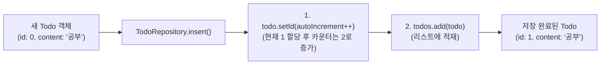

# 📄 [클래스 11] TodoRepository.java

- **소속 패키지**: `com.korai.ch10.TODO.repository`
- **파일 위치**: [`TodoRepository.java`](file:///Users/kangminjae/Documents/gov/java/study/src/main/java/com/korai/ch10/TODO/repository/TodoRepository.java)
- **주요 역할**: 할 일(Todo) 목록을 메모리에 저장하고 새 할 일을 추가하는 저장소 계층

---

## 1. 왜 이 클래스를 만들었는가? (설계 배경)

사용자가 애플리케이션을 사용하는 동안 등록하는 모든 할 일들을 안전하게 보관하는 가상 데이터베이스 역할을 합니다.  
특히 실제 관계형 데이터베이스(RDBMS)의 핵심 기능인 **Auto Increment(고유 번호 자동 1씩 증가)** 동작을 자바 코드로 직접 모방하여, 할 일이 등록될 때마다 겹치지 않는 고유 번호(ID)를 자동으로 부여하도록 설계되었습니다.

---

## 2. 코드 전체 보기 (상세 주석 포함)

```java
package com.korai.ch10.TODO.repository;

// [작성 이유]: 저장할 Todo 엔티티 클래스 import
import com.korai.ch10.TODO.entity.Todo;
// [작성 이유]: todos 리스트에 대한 Getter 메서드를 자동 생성하기 위해 Lombok import
import lombok.Getter;

import java.util.ArrayList;
import java.util.List;

public class TodoRepository {

    /*
     * [작성 이유: private int autoIncrement = 1]
     * 데이터베이스의 'AUTO_INCREMENT'를 자바 변수로 흉내 낸 카운터입니다.
     * 첫 번째 할 일에는 1번을 주고, 그 다음 할 일에는 2번을 주기 위해 초깃값을 1로 설정합니다.
     */
    private int autoIncrement = 1;

    /*
     * [작성 이유: @Getter (필드 레벨 적용)]
     * 클래스 전체에 붙이지 않고 이 변수(todos)에만 @Getter를 붙였습니다.
     * -> 이유: autoIncrement 변수는 외부에 노출될 필요가 전혀 없고 오직 todos 목록만
     *    외부(TodoService)에서 조회할 수 있도록 '최소 권한의 원칙'을 지키기 위함입니다.
     * 또한 Setter는 만들지 않아 외부에서 리스트 자체를 통째로 바꿔치기하는 것을 방지합니다.
     */
    @Getter
    private List<Todo> todos;

    /*
     * [작성 이유: 생성자에서 new ArrayList<>() 초기화]
     * 사용자가 등록할 때마다 항목이 동적으로 늘어나야 하므로,
     * 크기가 고정되지 않고 가변적인 ArrayList를 생성하여 빈 목록으로 출발합니다.
     */
    public TodoRepository() {
        todos = new ArrayList<>();
    }

    /*
     * [작성 이유: public void insert(Todo todo)]
     * 전달받은 할 일 객체에 새 고유 번호를 발급하고 리스트에 추가(저장)합니다.
     */
    public void insert(Todo todo) {
        /*
         * [작성 이유: todo.setId(autoIncrement++)]
         * '후위 증가 연산자(Postfix Increment)'의 절묘한 활용:
         * 1) 현재의 autoIncrement 값을 먼저 todo.setId()에 전달합니다 (예: 1).
         * 2) 그 직후 autoIncrement 값이 1 증가하여 다음 저장을 위해 2가 됩니다.
         * 이로써 단 한 줄로 ID 부여와 다음 번호 준비가 깔끔하게 처리됩니다.
         */
        todo.setId(autoIncrement++);

        // [작성 이유]: ID가 확정된 Todo 객체를 메모리 저장소 리스트에 최종 저장합니다.
        todos.add(todo);
    }
}
```

---

## 3. 핵심 코드 심층 해설 (왜 이렇게 작성했는가?)

### Q1. 클래스 선언부 위에 `@Getter`를 붙이지 않고 필드 위에 붙인 이유는?
- 클래스 선언부에 `@Getter`를 붙이면 `todos`뿐만 아니라 내부에서만 관리해야 하는 `autoIncrement` 변수까지 `getAutoIncrement()` 메서드가 생겨납니다.
- 내부 상태 변수를 불필요하게 캡슐 밖으로 노출하지 않기 위해 꼭 필요한 필드에만 선택적으로 `@Getter`를 적용한 훌륭한 객체지향 캡슐화 습관입니다.

### Q2. `autoIncrement++`의 동작 방식이 헷갈려요!
- `todo.setId(autoIncrement++);`는 아래의 두 줄 코드와 완전히 동일합니다:
  ```java
  todo.setId(this.autoIncrement); // 1. 현재 번호(예: 1)를 세팅
  this.autoIncrement = this.autoIncrement + 1; // 2. 다음 번호(2)로 1 증가
  ```
- 후위 연산자는 **"값을 먼저 쓰고 난 뒤에 1 올린다"**는 규칙을 가집니다.

---

## 4. 할 일 저장(insert) 과정


