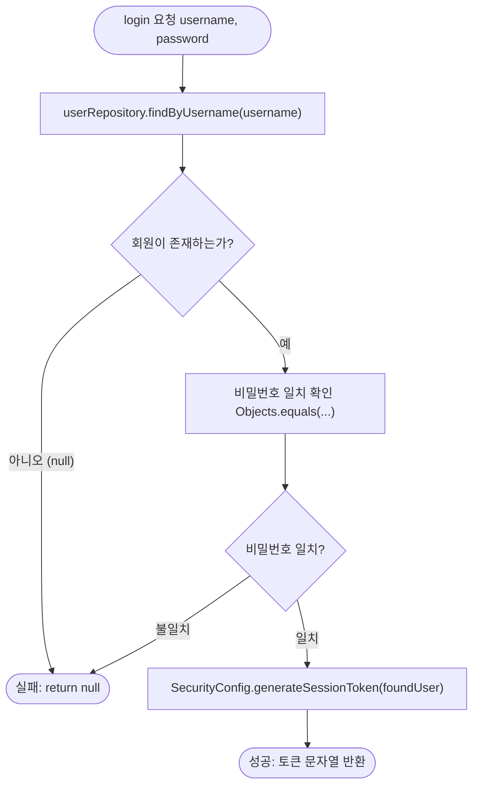

# 📄 [클래스 12] UserService.java

- **소속 패키지**: `com.korai.ch10.TODO.service`
- **파일 위치**: [`UserService.java`](file:///Users/kangminjae/Documents/gov/java/study/src/main/java/com/korai/ch10/TODO/service/UserService.java)
- **주요 역할**: 사용자 로그인 인증 및 보안 토큰 발급 비즈니스 로직 처리

---

## 1. 왜 이 클래스를 만들었는가? (설계 배경)

화면(View)은 사용자의 입력을 받는 창구일 뿐, "아이디가 존재하는지", "비밀번호가 일치하는지", "인증에 성공했을 때 어떤 보안 토큰을 발급해야 하는지"와 같은 **핵심 비즈니스 규칙(Business Logic)**을 화면에 작성하면 안 됩니다.  
화면과 데이터 저장소 사이에서 인증 정책을 총괄하는 서비스 계층으로서 `UserService`를 설계했습니다.

---

## 2. 코드 전체 보기 (상세 주석 포함)

```java
package com.korai.ch10.TODO.service;

// [작성 이유]: 로그인 성공 시 보안 세션 토큰 생성을 호출하기 위해 import
import com.korai.ch10.TODO.config.SecurityConfig;
// [작성 이유]: 회원 정보 조회를 위해 User 엔티티 import
import com.korai.ch10.TODO.entity.User;
// [작성 이유]: 데이터 저장소에서 회원을 검색하기 위해 UserRepository import
import com.korai.ch10.TODO.repository.UserRepository;
// [작성 이유]: final 필드를 매개변수로 받는 생성자를 자동 생성하기 위해 Lombok import
import lombok.RequiredArgsConstructor;

// [작성 이유]: 안전한 비밀번호 비교를 위해 Objects import
import java.util.Objects;

/*
 * [작성 이유: @RequiredArgsConstructor]
 * 스프링(Spring) 프레임워크에서도 가장 권장하는 '생성자 주입(DI)' 패턴을 완성해 주는 어노테이션입니다.
 * 클래스 내에 'final'로 선언된 필드(userRepository)를 매개변수로 받는 생성자를 자동으로 만듭니다.
 * 즉, public UserService(UserRepository userRepository) { this.userRepository = userRepository; }
 * 코드를 개발자가 직접 손으로 치지 않아도 됩니다.
 */
@RequiredArgsConstructor
public class UserService {

    /*
     * [작성 이유: private final UserRepository userRepository]
     * 1. private: 외부에서 마음대로 접근하지 못하도록 보호합니다.
     * 2. final: 한 번 주입된 리포지토리는 프로그램 실행 도중 절대 다른 객체로 바뀌지 않도록 불변성(Immutability)을 보장합니다.
     */
    private final UserRepository userRepository;

    /*
     * [작성 이유: public String login(String username, String password)]
     * 로그인 비즈니스 로직의 핵심 메서드:
     * 아이디와 비밀번호를 검증하여 성공 시 세션 토큰 문자열을 반환하고, 실패 시 null을 반환합니다.
     */
    public String login(String username, String password) {
        /*
         * [1단계: 사용자 존재 여부 확인]
         * 입력받은 아이디(username)로 데이터베이스(저장소)에서 회원을 조회합니다.
         */
        User foundUser = userRepository.findByUsername(username);

        /*
         * [작성 이유: if (foundUser == null)]
         * 해당 아이디를 가진 회원이 아예 존재하지 않는 경우입니다.
         * 더 이상 비밀번호를 확인할 필요도 없으므로 즉시 null을 리턴하여 실패를 알립니다.
         */
        if (foundUser == null) {
            return null;
        }

        /*
         * [2단계: 비밀번호 일치 여부 확인]
         * Objects.equals를 사용하여 저장소의 비밀번호와 사용자가 입력한 비밀번호가 일치하는지 비교합니다.
         * 일치하지 않는다면(!), 잘못된 비밀번호이므로 null을 리턴하여 실패를 알립니다.
         */
        if (!Objects.equals(foundUser.getPassword(), password)) {
            return null;
        }

        /*
         * [3단계: 인증 성공 및 토큰 발급]
         * 아이디와 비밀번호가 모두 올바르므로, SecurityConfig 유틸리티를 호출하여
         * 해당 회원의 정보가 담긴 안전한 세션 토큰(UUID@userId)을 생성하여 반환합니다.
         */
        return SecurityConfig.generateSessionToken(foundUser);
    }
}
```

---

## 3. 핵심 코드 심층 해설 (왜 이렇게 작성했는가?)

### Q1. 비밀번호가 틀렸을 때 왜 "비밀번호가 틀렸습니다"와 "아이디가 없습니다"를 구별해서 반환하지 않나요?
- **보안의 기본 원칙 (User Enumeration 방지)** 때문입니다.
- 공격자가 "아이디는 맞는데 비밀번호가 틀렸군"이라는 힌트를 얻어 무차별 대입 공격(Brute-force)을 시도하는 것을 막기 위해, 실무 시스템에서는 둘 다 똑같이 `null`(로그인 실패)로 처리하고 화면에도 "로그인 정보를 다시 확인하세요"라고 통일하여 보여줍니다.

### Q2. `@RequiredArgsConstructor`와 `final` 키워드의 조합이 왜 좋은가요?
- 개발자가 실수로 의존성 주입 코드를 빼먹는 것을 방지합니다.
- `final` 필드는 반드시 생성자에서 값이 채워져야 하므로, 컴파일 타임에 누락 여부를 잡아낼 수 있어 런타임에 `NullPointerException`이 발생하는 것을 근본적으로 차단합니다.

---

## 4. 로그인 인증 흐름도


