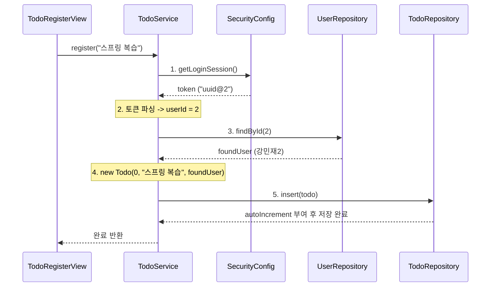

# 📄 [클래스 13] TodoService.java

- **소속 패키지**: `com.korai.ch10.TODO.service`
- **파일 위치**: [`TodoService.java`](file:///Users/kangminjae/Documents/gov/java/study/src/main/java/com/korai/ch10/TODO/service/TodoService.java)
- **주요 역할**: 할 일 목록 조회 및 로그인 세션과 연계된 할 일 등록 비즈니스 로직 처리

---

## 1. 왜 이 클래스를 만들었는가? (설계 배경)

할 일을 등록할 때 가장 중요한 것은 **"지금 로그인한 사용자가 누구인가?"**를 추적하여 해당 사용자를 할 일의 주인으로 지정해 주는 것입니다.  
`TodoService`는:
1. `TodoRepository`로부터 전체 할 일 목록을 받아 화면에 전달하고,
2. 새 할 일이 들어왔을 때 **보안 세션 토큰을 해독 $\rightarrow$ 작성자 조회 $\rightarrow$ Todo 객체 조립 $\rightarrow$ 저장소 삽입**이라는 전체 비즈니스 파이프라인을 지휘하는 핵심 두뇌 역할을 수행합니다.

---

## 2. 코드 전체 보기 (상세 주석 포함)

```java
package com.korai.ch10.TODO.service;

// [작성 이유]: 전역 세션에서 현재 로그인된 토큰을 가져오기 위해 import
import com.korai.ch10.TODO.config.SecurityConfig;
// [작성 이유]: 조립 및 반환할 도메인 엔티티 import
import com.korai.ch10.TODO.entity.Todo;
import com.korai.ch10.TODO.entity.User;
// [작성 이유]: 할 일 데이터와 유저 데이터를 조회/저장하기 위해 두 개의 저장소 import
import com.korai.ch10.TODO.repository.TodoRepository;
import com.korai.ch10.TODO.repository.UserRepository;
// [작성 이유]: 생성자 주입 코드를 자동화하기 위해 Lombok import
import lombok.RequiredArgsConstructor;

import java.util.List;

/*
 * [작성 이유: @RequiredArgsConstructor]
 * 아래의 final 필드 2개(todoRepository, userRepository)를 매개변수로 받는
 * 생성자를 자동 생성합니다. (RootRouter에서 new TodoService(todoRepo, userRepo)로 조립됨)
 */
@RequiredArgsConstructor
public class TodoService {

    // [작성 이유]: 할 일 저장 및 조회를 담당하는 리포지토리 의존성
    private final TodoRepository todoRepository;
    // [작성 이유]: 세션 토큰에서 추출한 userId로 실제 User 객체를 찾아내기 위한 리포지토리 의존성
    private final UserRepository userRepository;

    /*
     * [작성 이유: public List<Todo> getTodoList()]
     * 저장소에 보관된 모든 할 일 목록을 조회하여 화면(TodoListView)에 그대로 반환합니다.
     */
    public List<Todo> getTodoList() {
        return todoRepository.getTodos();
    }

    /*
     * [작성 이유: public void register(String content)]
     * 화면으로부터 오직 텍스트 내용(content)만 전달받아,
     * 세션 토큰과 결합하여 완전한 Todo 엔티티를 생성하고 저장하는 핵심 비즈니스 메서드입니다.
     */
    public void register(String content) {
        /*
         * [1단계: 현재 로그인된 세션 토큰 가져오기]
         * SecurityConfig에 저장된 전역 세션 토큰("uuid@userId" 형태)을 읽어옵니다.
         */
        String token = SecurityConfig.getLoginSession();

        /*
         * [2단계: 토큰에서 userId 번호 파싱(추출)하기]
         * - token.indexOf("@") : '@' 문자가 위치한 인덱스 번호를 찾습니다.
         * - token.substring(...) : '@' 바로 다음 글자(+1)부터 끝까지 잘라내어 순수 숫자 문자열만 추출합니다.
         * - Integer.parseInt(...) : 추출한 숫자 문자열("1")을 실제 정수형 int(1)로 변환합니다.
         */
        int userId = Integer.parseInt(token.substring(token.indexOf("@") + 1));

        /*
         * [3단계: 식별된 번호로 실제 User 객체 조회]
         * 데이터베이스(UserRepository)에서 해당 ID를 가진 실제 회원 엔티티를 찾아옵니다.
         */
        User foundUser = userRepository.findById(userId);

        /*
         * [4단계: 완전한 Todo 엔티티 객체 생성]
         * - id: 0 (저장소에서 autoIncrement로 자동 채워질 예정이므로 임시값 0 전달)
         * - content: 매개변수로 전달받은 내용
         * - user: 3단계에서 찾은 작성자 객체
         */
        Todo todo = new Todo(0, content, foundUser);

        /*
         * [5단계: 저장소에 최종 삽입]
         * 완성된 할 일 객체를 저장소에 등록합니다. (이때 고유 ID가 발급됨)
         */
        todoRepository.insert(todo);
    }
}
```

---

## 3. 핵심 코드 심층 해설 (왜 이렇게 작성했는가?)

### Q1. `token.substring(token.indexOf("@") + 1)`의 동작 원리를 자세히 설명해 주세요!
- 토큰 문자열이 `a1b2c3d4e5@3` 형태라고 가정해 보겠습니다.
  1. `token.indexOf("@")`는 `@` 기호의 위치 인덱스인 `10`을 반환합니다.
  2. `token.indexOf("@") + 1`은 그 다음 글자의 시작 인덱스인 `11`이 됩니다.
  3. `token.substring(11)`은 11번 인덱스부터 문자열 끝까지 자르므로 `"3"`이라는 문자열이 남습니다.
  4. `Integer.parseInt("3")`을 통해 최종적으로 정수 `3`을 얻게 됩니다.
- 구분자(`@`) 하나만으로 복잡한 파서 없이도 가볍게 사용자 식별 번호를 분리해 낸 똑똑한 기법입니다.

### Q2. `TodoService`가 왜 `UserRepository`까지 의존하고 있나요?
- `Todo` 엔티티는 단순한 글자뿐만 아니라 **"작성자(`User`)"** 객체를 참조해야 하기 때문입니다.
- 세션 토큰에서는 숫자(`userId`)만 얻을 수 있으므로, 완전한 `User` 객체를 얻어 `Todo`에 주입하려면 `UserRepository.findById()` 호출이 반드시 필요합니다.

---

## 4. 할 일 등록(register) 상세 파이프라인


