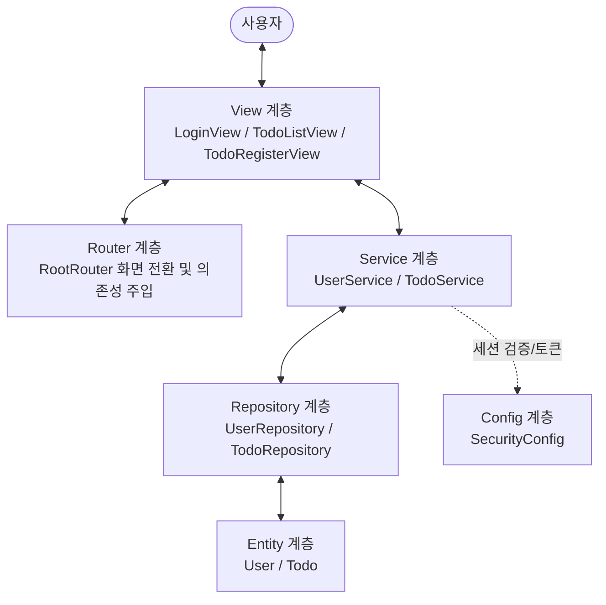

# 📋 TODO 애플리케이션 아키텍처 및 클래스별 문서 가이드

> 본 문서는 `com.korai.ch10.TODO` 패키지에 구현된 콘솔 기반 TODO 애플리케이션의 구조와 설계를 쉽게 이해할 수 있도록 정리한 통합 가이드입니다.  
> **모든 클래스마다 한 장씩 별도의 상세 해설 문서**가 마련되어 있으며, 코드 하나하나에 **"왜 이렇게 작성했는가?"**에 대한 친절한 주석과 해설이 담겨 있습니다.

---

## 🏗️ 1. 전체 아키텍처 개요 (Layered Architecture)

본 프로젝트는 실무 웹/서버 애플리케이션에서 가장 널리 쓰이는 **계층형 아키텍처(Layered Architecture)**와 **MVC 패턴(Model-View-Controller)**의 개념을 콘솔 환경에 맞게 적용하여 설계되었습니다.

### 각 계층(Layer)의 역할 분담
1. **View 계층 (`view/`)**: 사용자에게 화면을 출력(`System.out`)하고 콘솔 입력(`Scanner`)을 받는 책임만 가집니다. 비즈니스 로직을 직접 처리하지 않고 Service에 위임합니다.
2. **Router 계층 (`router/`)**: 화면 간의 이동(페이지 전환)을 중개하고, 프로그램에 필요한 모든 객체를 생성하여 연결(의존성 주입)해 주는 IoC 컨테이너 역할을 수행합니다.
3. **Service 계층 (`service/`)**: 핵심 비즈니스 로직(로그인 검증, 세션 토큰에서 유저 추출 후 할 일 등록 등)을 처리합니다.
4. **Repository 계층 (`repository/`)**: 데이터의 저장, 조회, 자동 번호 부여(Auto Increment)를 담당하는 가상 데이터베이스 역할을 합니다.
5. **Entity 계층 (`entity/`)**: 시스템에서 다루는 데이터의 뼈대(사용자, 할 일)를 정의합니다.
6. **Config 계층 (`config/`)**: 전역 로그인 세션 및 토큰 발급 등 공통 보안 설정을 관리합니다.

---

## 🗂️ 2. 클래스별 상세 문서 목차 (한 장씩 보기)

각 클래스/인터페이스마다 코드 전체와 **"왜 이렇게 코드를 짰는지"**에 대한 상세 주석 및 핵심 문법 설명이 정리되어 있습니다.

| 번호 | 문서 링크 | 대상 파일 | 주요 역할 및 핵심 설계 포인트 |
|:---:|:---|:---|:---|
| 01 | [01_TodoApplication.md](./01_TodoApplication.md) | `TodoApplication.java` | 프로그램의 메인 진입점. 이벤트 루프(`while(true)`)로 화면 실행 |
| 02 | [02_View.md](./02_View.md) | `View.java` | 모든 뷰가 구현해야 할 공통 규격(인터페이스, 다형성 적용) |
| 03 | [03_LoginView.md](./03_LoginView.md) | `LoginView.java` | 로그인 화면 출력, 사용자 입력 검증 요청 및 세션 저장 |
| 04 | [04_TodoListView.md](./04_TodoListView.md) | `TodoListView.java` | 할 일 목록 출력 및 메뉴 선택(등록 이동 / 로그아웃) |
| 05 | [05_TodoRegisterView.md](./05_TodoRegisterView.md) | `TodoRegisterView.java` | 새 할 일 내용 입력받고 서비스에 등록 위임 |
| 06 | [06_RootRouter.md](./06_RootRouter.md) | `RootRouter.java` | 전체 객체 조립(DI) 및 화면 전환 관리 라우터 |
| 07 | [07_SecurityConfig.md](./07_SecurityConfig.md) | `SecurityConfig.java` | 전역 로그인 세션 보관 및 UUID 기반 토큰 생성 |
| 08 | [08_User.md](./08_User.md) | `User.java` | 사용자 도메인 엔티티 (Lombok 활용) |
| 09 | [09_Todo.md](./09_Todo.md) | `Todo.java` | 할 일 도메인 엔티티 (User와의 객체 연관관계 매핑) |
| 10 | [10_UserRepository.md](./10_UserRepository.md) | `UserRepository.java` | 사용자 데이터 초기화 및 username / id 기반 조회 |
| 11 | [11_TodoRepository.md](./11_TodoRepository.md) | `TodoRepository.java` | 동적 할 일 리스트 보관 및 Auto Increment PK 자동 발급 |
| 12 | [12_UserService.md](./12_UserService.md) | `UserService.java` | 로그인 인증 로직 및 세션 토큰 발급 비즈니스 로직 |
| 13 | [13_TodoService.md](./13_TodoService.md) | `TodoService.java` | 현재 세션에서 유저 식별 후 할 일 등록 및 목록 반환 |

---

## 💡 3. 프로젝트의 핵심 학습 포인트

1. **의존성 주입(Dependency Injection, DI)**:
   - 각 클래스가 `new`로 다른 객체를 직접 만들지 않고, 생성자를 통해 외부에서 주입받도록 작성하여 **결합도(Coupling)를 대폭 낮췄습니다.**
2. **다형성(Polymorphism)을 통한 유연한 라우팅**:
   - `View` 인터페이스 덕분에 라우터나 메인 메서드는 화면의 구체 클래스가 무엇인지 몰라도 `show()` 하나만 호출하면 됩니다.
3. **토큰 기반 세션 관리 기법**:
   - `UUID + "@" + userId` 구조를 통해, 별도의 복잡한 세션 스토리지 없이도 토큰 자체에서 사용자의 고유 ID를 안전하게 식별하는 아이디어를 구현했습니다.
4. **관심사의 분리(Separation of Concerns)**:
   - 화면 출력(View), 화면 전환(Router), 업무 규칙(Service), 데이터 보관(Repository)이 철저하게 분리되어 유지보수가 매우 쉽습니다.
